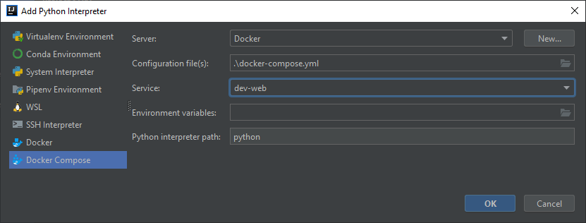
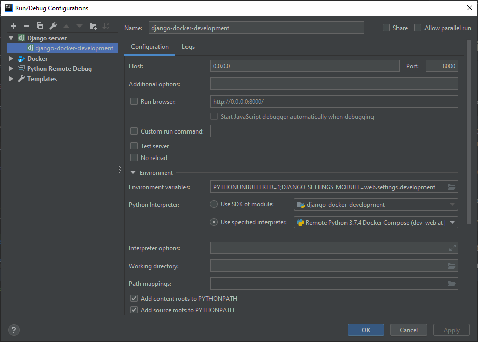

# django-docker-development
An example repository of combining Django REST Framework with PostgreSQL, which uses Docker as a development machine.

## Requirements

* Docker 2.0.0.2 or more
* Docker-compose 1.23.2 or more

## Stack

* Python 3.7
* Django 2.2.10
* Django REST Framework 3.10.3
* psycopg2 2.8.3

## Before run

To create db volume for Windows: 
```
./bin/create_docker_volumes.bat
```
or for Linux:
```
./bin/create_docker_volumes.sh
```

## Simple development run

To start the Django REST server, use the following command in the project folder:
```
docker-compose up
```
After that app should be up on http://localhost:8000 in development mode (with automatic update).

## Run/Debug in Intellij Idea or PyCharm

Make the follow commands:

* Remove the `python manage.py runserver 0.0.0.0:8000` in file `entrypoint.sh`
* `Project Structure...` or `Ctrl + Alt + Shift + S` > `Project` > Add new `Python SDK` with the following options:



* Configure the `Run/Debug Configurations` as in the picture below:



Now you can run the project in debug mode using the previously created configuration.
